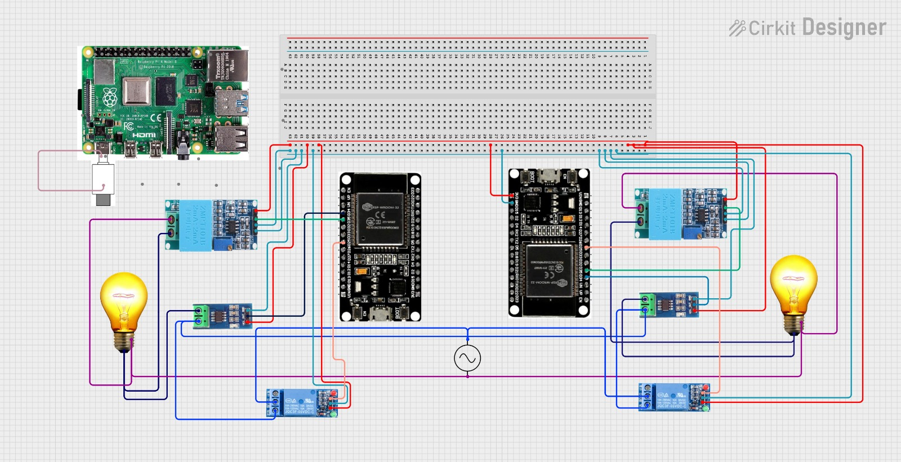

<!--
Tags: IoT, ESP32, MQTT, Edge Computing, Energy Management, Adafruit IO, Smart Home
-->

# ⚡ Edge-IoT Based Smart Energy Management System

### 🧠 Overview
This project implements an **IoT-based Smart Energy Management System** that monitors and controls the electrical parameters of multiple rooms using a **two-tier architecture**:  
- **End Devices (ESP32 nodes)** measure voltage and current, and  
- An **Edge Device (Raspberry Pi)** performs power calculation, anomaly detection, and cloud visualization.  

The processed data is visualized on the **Adafruit IO Cloud Dashboard**, providing real-time insights into energy usage and enabling remote control of connected devices.

---

## 🏗️ System Architecture


- Each **End Node** → Reads voltage & current → Sends data via MQTT  
- **Edge Device** → Calculates power (W) and energy (kWh), detects anomalies  
- **Cloud (Adafruit IO)** → Displays real-time power & total energy dashboard  

---

## 🧩 Components Used

| Module | Function |
|--------|-----------|
| **ESP32** | End device for sensing voltage & current |
| **Raspberry Pi 3/4** | Edge device for local MQTT and data processing |
| **ACS712 (30A)** | Current sensing module |
| **ZMPT101B** | Voltage sensing module |
| **Relay Module** | For controlling load on anomaly detection |
| **Adafruit IO** | Cloud visualization platform |
| **Wi-Fi Network** | Communication backbone |
| **Python (paho-mqtt + adafruit-io)** | Edge data processing |
| **Arduino IDE** | Node firmware development |

---

## ⚙️ Working Principle

1. Each **end node (ESP32)** measures:
   - Voltage using ZMPT101B  
   - Current using ACS712  
2. Data is sent to the **Edge Device** via a local MQTT broker.  
3. The **Edge Device (Python script)**:
   - Calculates Power = Voltage × Current  
   - Computes Energy (kWh) over time  
   - Detects anomalies (overvoltage / overcurrent)  
   - Controls relays in each node via MQTT commands  
   - Publishes node-wise and total energy data to **Adafruit IO Cloud**  
4. The **Adafruit IO Dashboard** visualizes:
   - `node1_power`  
   - `node2_power`  
   - `total_energy`

---


## 🧭 Circuit Diagram
> 


---


### 🌐 Network / MQTT Connections

| Device | Role | Connection |
|---------|------|-------------|
| **ESP32 Node 1** | End Device | Publishes data → `ems/node1/data` |
| **ESP32 Node 2** | End Device | Publishes data → `ems/node2/data` |
| **Raspberry Pi (Edge)** | MQTT Broker & Processor | Subscribes to node topics and publishes control messages |
| **Adafruit IO Cloud** | Dashboard | Receives processed power and energy data |

---
## 📡 MQTT Topics

| Node | Publish Topic | Subscribe Topic |
|------|----------------|----------------|
| Node 1 | `ems/node1/data` | `ems/node1/control` |
| Node 2 | `ems/node2/data` | `ems/node2/control` |

Example JSON payload from nodes:
```json
{
  "voltage": 230.5,
  "current": 0.45
}
```


## 🐍 Edge Device (Python Script)

- Main features:
   - Subscribes to MQTT data from ESP32 nodes
   - Calculates power, energy locally
   - Sends processed data to Adafruit IO
   - Performs relay control based on anomalies
   - Run it on your Raspberry Pi:
  ```bash
  pip install paho-mqtt adafruit-io
  python3 edge_code.py
  ```
## 💻 Node Firmware (ESP32)

- Each ESP32:
  - Reads voltage & current from sensors
  - Sends data via MQTT to edge device
  - Subscribes to control topic to toggle relay
- Key libraries:
  - WiFi.h
  - PubSubClient.h
  - ZMPT101B.h
  - ACS712.h

## ☁️ Adafruit IO Dashboard

- Feeds:
  - node1_power
  - node2_power
  - total_energy

- Dashboard Visualization:
  - Line chart for real-time power
  - Gauge for total energy usage
  - Optional indicators for relay status

## ⚠️ Anomaly Detection Logic
``` python
if voltage > 245 or current > 2.0:
    publish("relay", "OFF")
else:
    publish("relay", "ON")
```
---
## 🧪 Results

- ✅ Accurate voltage, current, and power readings per room
- ✅ Total energy computation at edge
- ✅ Overvoltage & overcurrent protection
- ✅ Real-time dashboard visualization on Adafruit IO
- ✅ Scalable and modular design for multi-room expansion

---

## Future Enhancements

- Add mobile alerts for anomaly notifications
- Use AI-based prediction for energy optimization
- Support for solar and battery monitoring
- Add local web dashboard for offline visualization
- Integration with Google Assistant / Alexa
  
© 2025 Abin


               
